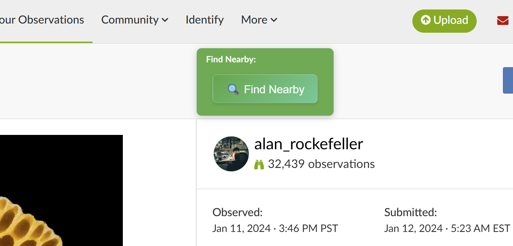

# iNaturalist Genus Proximity Finder Browser Extension

Ever been on an iNaturalist observation page and wondered what else is around from the same genus?   This browser extension makes it easy to check - I like to use it to see what other people have identified nearby observations as, or if someone gives you an ID, find nearby observations that it also might apply to.

## What it does

Basically, when you're looking at an observation on iNaturalist, this extension adds a button. Click it, and it'll try its best to figure out the genus (or a higher taxonomic group if genus is tricky) of that observation. Then it'll open up a new iNaturalist search page showing you other observations of that same genus within a 10 km radius. Super useful for finding related species or just exploring what else is nearby.

## How to Install

Since this is a browser extension, you'll need to load it manually into your browser (like Chrome or Firefox).

1.  **Download/Clone:** Get the extension files onto your computer.
2.  **Open Extension Management:**
    *   **Chrome:** Go to `chrome://extensions/`
    *   **Firefox:** Go to `about:addons` and click the gear icon, then "Debug Add-ons".
3.  **Enable Developer Mode:**
    *   **Chrome:** Toggle the "Developer mode" switch in the top right.
    *   **Firefox:** You might need to go to `about:config` and set `xpinstall.signatures.required` to `false` (use with caution!).
4.  **Load Unpacked:**
    *   **Chrome:** Click the "Load unpacked" button in the top left and select the `browser-extension` folder.
    *   **Firefox:** Click "Load Temporary Add-on..." and select any file within the `browser-extension` folder.

Your extension should now be active!

## How to Use It

1.  Navigate to any observation page on [iNaturalist.org] - for example https://www.inaturalist.org/observations/313200882.
2.  Look for a green button that says **"🔍 Find Nearby"**. It usually pops up near the top of the page.
3.  Click that button!
4.  A new tab will open showing you iNaturalist observations of the same genus nearby. 

If the observation is identified to species level, the extension tries to find and use the genus for the search. If the observation is identified as a higher level taxon, it'll show nearby observations of that taxon.

--Alan Rockefeller
September 24, 2025
